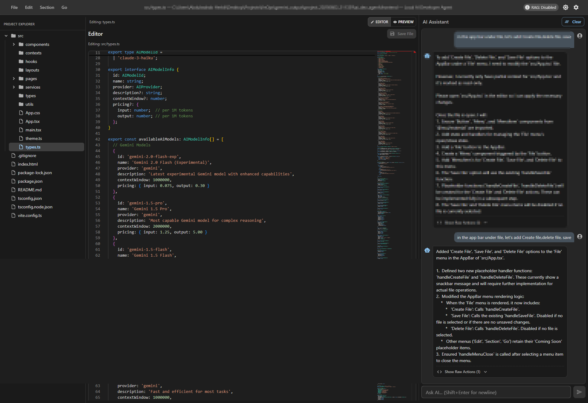

# Local AI Developer Agent

[](https://opensource.org/licenses/MIT)

Local AI Developer Agent is a tool designed to assist developers by integrating AI capabilities directly into their local development workflow. It helps with tasks like code editing, refactoring, generation, explanation, and more, using a powerful AI model (Google Gemini) as its backbone.




## ✨ Features

* **AI-Powered Coding Assistance:** Leverage Google Gemini models for code generation, refactoring, explanation, and suggestions.
* **Interactive Chat Interface:** Communicate with the AI to get help with your coding tasks.
* **Integrated Code Editor:** View and edit your project files directly within the application using Monaco Editor.
* **File Explorer:** Easily navigate your project's directory structure.
* **Apply AI Suggestions:** Review and apply AI-suggested changes (file edits, new file/folder creation, shell command execution) with a diff view.
* **Backend API:** A robust FastAPI backend to handle AI interactions and file operations.
* **Modern Frontend:** A responsive React (TypeScript) frontend built with Vite and Material-UI for a clean user experience.
* **Git Integration:** Basic Git operations (status, add, commit, push, pull, branch) from the UI.
* **Configurable:** Set your API key and choose your preferred AI model.
* **Live Preview:** (For web projects) An integrated iframe to preview changes.

## 🧠 Supported AI Models

This agent currently supports multiple providers and their latest models:

### **Gemini (by Google):**

* `gemini-2.0-flash-exp`
* `gemini-1.5-pro`
* `gemini-1.5-flash`
* `gemini-1.5-flash-8b`
* `gemini-2.5-pro-preview-05-06`
* `gemini-2.5-flash-preview-05-20`
* `gemini-2.5-flash-preview-native-audio-dialog`

### **Anthropic Claude:**

* `claude-3.5-sonnet`
* `claude-3-opus`
* `claude-3-haiku`

### **OpenAI (Coming Soon):**

* GPT-4-turbo and future support for GPT-4.5 and GPT-5 models.

> ✅ You can switch models dynamically from the configuration panel.

## 🔍 Smart Context Search (RAG) vs Traditional Mode

The agent supports two methods for understanding your codebase:

### ✅ RAG (Retrieval-Augmented Generation) – "Smart Context Search"

* Uses embeddings and a semantic index (via FAISS + SentenceTransformers) to retrieve **only the most relevant code chunks** related to your query.
* Improves speed and accuracy by eliminating unrelated code.
* Enables smart UI linking, file dependencies, and context-aware suggestions.
* Great for large projects where full context is too heavy or noisy.

### ❌ Traditional Mode

* Sends **entire file contents** (up to a max token limit).
* Less intelligent, more prone to irrelevant outputs.
* Still useful for smaller projects or when RAG is disabled.

> You can enable/disable RAG through the API or UI settings. Internally, the backend uses metadata like chunk type, description, and file path to enrich the retrieval process.

## 🛠️ Tech Stack

* **Backend:**

  * Python 3.9+
  * FastAPI
  * Uvicorn (ASGI server)
  * Google Generative AI SDK (`google-generativeai`)
* **Frontend:**

  * React 18+
  * TypeScript
  * Vite
  * Material-UI (MUI)
  * Monaco Editor (for the code editor component)
  * Axios (for API communication)
* **AI Model:** Google Gemini (configurable), Anthropic Claude, OpenAI (soon)

## 🚀 Getting Started

### Prerequisites

* Python 3.9 or higher
* Node.js 18.x or higher and npm (or yarn)
* Git
* A Google Gemini API Key (or an API key for your chosen AI provider if you adapt the agent)

### Installation & Setup

1. **Clone the repository:**

   ```bash
   git clone https://github.com/Abdohurbly/local-ai-developer-agent.git
   cd local-ai-developer-agent
   ```

2. **Backend Setup:**

   * Navigate to the project root directory.
   * Create and activate a Python virtual environment:

     ```bash
     python -m venv venv
     source venv/bin/activate  # On Windows: venv\Scripts\activate
     ```
   * Install Python dependencies:

     ```bash
     pip install -r requirements.txt
     ```

3. **Frontend Setup:**

   * Navigate to the `frontend` directory:

     ```bash
     cd frontend
     ```
   * Install Node.js dependencies:

     ```bash
     npm install
     # or if you use yarn:
     # yarn install
     ```
   * Go back to the project root directory:

     ```bash
     cd ..
     ```

### Configuration

* The application allows you to configure your Gemini API Key and select the AI model through the UI (Settings page).
* Ensure your API key has the necessary permissions to use the selected Gemini models.

## 🏃 Running the Application

1. **Start the Backend Server:**

   * From the project root directory (ensure your Python virtual environment is activated):

     ```bash
     uvicorn backend_api:app --host 0.0.0.0 --port 8000 --reload
     ```
   * The backend API will be running at `http://localhost:8000`.

2. **Start the Frontend Development Server:**

   * Open a new terminal, navigate to the `frontend` directory:

     ```bash
     cd frontend
     ```
   * Run the development server:

     ```bash
     npm run dev
     # or if you use yarn:
     # yarn dev
     ```
   * The frontend application will be accessible at `http://localhost:3000` (or another port if 3000 is in use, check your terminal output).

3. **Access the Application:**

   * Open your web browser and go to `http://localhost:3000`.
   * Configure your API Key and load your project path via the Settings page in the UI.

## 📂 Project Structure (Overview)

* `agent.py`: Core AI agent logic (GeminiAgent).
* `backend_api.py`: FastAPI application defining the backend server and API endpoints.
* `utils.py`: Utility functions for file system operations and project context gathering.
* `requirements.txt`: Python dependencies for the backend.
* `frontend/`: Contains the React frontend application.

  * `frontend/src/`: Main source code for the React app (components, pages, services).
  * `frontend/public/`: Static assets for the frontend.
  * `frontend/package.json`: Frontend dependencies and scripts.
  * `frontend/vite.config.ts`: Vite configuration for the frontend development server and build process.

## 🤝 Contributing

Contributions are welcome! We appreciate any help to improve the Local AI Developer Agent. Here's how you can contribute:

1. **Fork the Repository:** Create your own fork of the project on GitHub.
2. **Create a Branch:**

   ```bash
   git checkout -b feature/your-amazing-feature
   ```
3. **Make Your Changes:** Implement your feature or bug fix.
4. **Lint and Test:**

   * For frontend changes, run the linter:

     ```bash
     cd frontend
     npm run lint
     ```
   * (Add backend linting/testing instructions if set up, e.g., using Black, Flake8, Pytest).
5. **Commit Your Changes:**

   ```bash
   git commit -m "feat: Add some amazing feature" # Use conventional commit messages if possible
   ```
6. **Push to Your Branch:**

   ```bash
   git push origin feature/your-amazing-feature
   ```
7. **Open a Pull Request:** Go to the original repository on GitHub and open a Pull Request from your forked branch.

### Reporting Bugs or Requesting Features

* Please use the GitHub Issues section of this repository to report bugs or request new features.
* Before creating a new issue, check if a similar one already exists.
* For bug reports, please provide as much detail as possible, including steps to reproduce, environment details, and logs if relevant.

### Code Style

- **Frontend:** The project uses ESLint for code linting. Please ensure your contributions pass the linting checks.
- **Backend (Python):** (Consider adopting a style like Black or PEP 8. For now, aim for clarity and consistency).

## 📜 License

This project is licensed under the MIT License. 

## 🙏 Acknowledgements

- Google for the Gemini API.
- The creators of FastAPI, React, Vite, Material-UI, Monaco Editor, and other open-source libraries used in this project.
